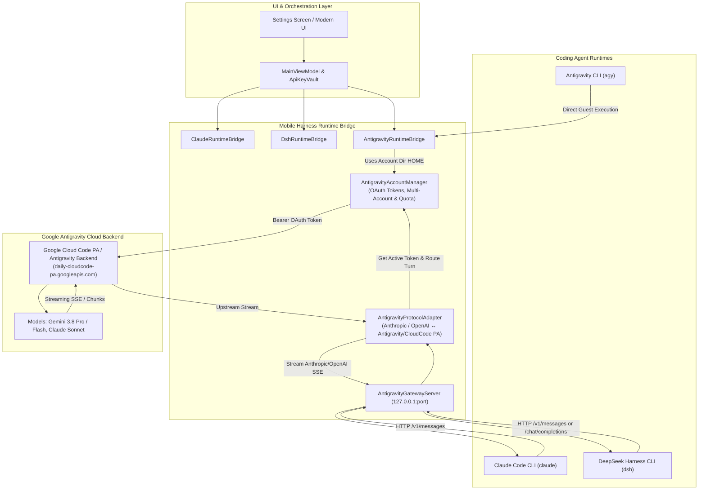
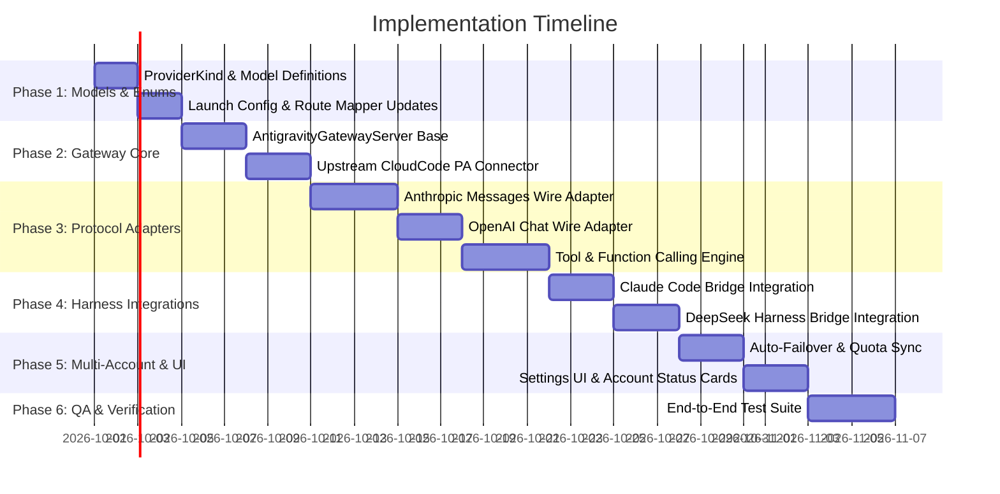

# Product Requirements Document (PRD)
## Unified Antigravity Server & OAuth Bridge for DeepSeek Harness and Claude Code

**Document Version:** 1.0.0  
**Status:** Approved for Implementation  
**Target Release:** Mobile Harness v2026.10  
**Target Platform:** Android (ARM64 PRoot Linux Runtime)  
**Affected Subsystems:** `app/src/main/java/com/jarves/mh/model/`, `com/jarves/mh/runtime/`, `com/jarves/mh/ui/`, `com/jarves/mh/network/`

---

## 1. Executive Summary & Problem Statement

### 1.1 Context
Mobile Harness (`mh`) provides mobile software engineers with three independent, sandboxed AI coding agent runtimes:
1. **Antigravity CLI (`agy`)**: Google's official coding agent engine, authenticated via Google OAuth with multi-account rotation and access to Google's Antigravity backend server and models (`gemini-3.8-flash`, `gemini-3.8-pro`, `claude-3-7-sonnet`).
2. **DeepSeek Harness (`dsh`)**: DeepSeek's official coding agent engine, architected around API-key provider routes and headless/SDK protocol turns.
3. **Claude Code (`claude`)**: Anthropic's flagship terminal coding agent, accepting Anthropic Messages API compatible gateways or direct Claude subscription tokens.

### 1.2 The Problem
Currently, authentication and model access are siloed by agent:
- Antigravity users sign in with their Google account once via [`AntigravityAuthController`](file:///workspace/clever-kalam/app/src/main/java/com/jarves/mh/runtime/AntigravityAuthController.kt) and [`AntigravityAccountManager`](file:///workspace/clever-kalam/app/src/main/java/com/jarves/mh/runtime/AntigravityAccountManager.kt), unlocking generous quota tiers and Google's high-tier models.
- However, if the user switches to **Claude Code** or **DeepSeek Harness** to take advantage of their specialized agent behaviors (such as Claude Code's extensive tool ecosystem or DeepSeek Harness's compact, fast SDK execution), they are blocked unless they acquire and configure separate paid third-party API keys (e.g. Anthropic Console, DeepSeek API, OpenRouter, Kimi) or a dedicated Claude subscription.
- This creates unnecessary friction, duplicate billing, and prevents users from leveraging their existing authenticated Google Antigravity session across all three harnesses.

### 1.3 The Solution
Implement a **Unified Antigravity Gateway Server** (`AntigravityGatewayServer`) within Mobile Harness. This gateway runs on a private loopback address (`127.0.0.1:<ephemeral-port>`), authenticates upstream using the active Google OAuth token from [`AntigravityAccountManager`](file:///workspace/clever-kalam/app/src/main/java/com/jarves/mh/runtime/AntigravityAccountManager.kt), and presents standard:
1. **Anthropic Messages API** endpoint (`/v1/messages`) for **Claude Code** and **DeepSeek Harness** (`anthropic-messages` route).
2. **OpenAI Chat Completions API** endpoint (`/v1/chat/completions`) for **DeepSeek Harness** (`openai-completions` route).

By selecting **"Antigravity Server (Google OAuth)"** as the provider, both Claude Code and DeepSeek Harness directly utilize Antigravity backend models (Gemini 3.8/2.5 Pro & Flash, Claude Sonnet via Cloud Code PA) at zero additional cost, while inheriting multi-account failover and quota management.

---

## 2. High-Level Architecture & Data Flow



---

## 3. Product Requirements & Features

### 3.1 Feature 1: New Provider Definition — `ProviderKind.ANTIGRAVITY_SERVER`
- **Location:** [`Models.kt`](file:///workspace/clever-kalam/app/src/main/java/com/jarves/mh/model/Models.kt)
- **Properties:**
  - `title`: `"Antigravity Server"`
  - `subtitle`: `"Google OAuth · Gemini & Claude models"`
  - `protocol`: `ProviderProtocol.ANTHROPIC_GATEWAY` (inherently supported by Claude Code and DeepSeek Harness)
  - `defaultModel`: `"gemini-3.8-pro"`
  - `fixedBaseUrl`: `true` (dynamically resolves to the local loopback gateway URL)
- **Harness Compatibility:**
  - Added to [`DEEPSEEK_HARNESS_PROVIDERS`](file:///workspace/clever-kalam/app/src/main/java/com/jarves/mh/model/Models.kt#L86): DeepSeek Harness users can select Antigravity Server.
  - Added to [`providersForAgent(AgentKind.CLAUDE_CODE)`](file:///workspace/clever-kalam/app/src/main/java/com/jarves/mh/model/Models.kt#L137): Claude Code users can select Antigravity Server.
  - Secret Handling: Does NOT require manual API key input in [`ApiKeyVault`](file:///workspace/clever-kalam/app/src/main/java/com/jarves/mh/data/ApiKeyVault.kt). If selected, the app verifies that at least one Google OAuth account is logged in via [`AntigravityAccountManager`](file:///workspace/clever-kalam/app/src/main/java/com/jarves/mh/runtime/AntigravityAccountManager.kt).

### 3.2 Feature 2: Loopback Antigravity Gateway Server (`AntigravityGatewayServer`)
- **Location:** `app/src/main/java/com/jarves/mh/runtime/AntigravityGatewayServer.kt`
- **Lifecycle:**
  - Bound to `127.0.0.1` on a random available port (e.g. `ServerSocket(0)`).
  - Started on-demand when a session starts in [`ClaudeRuntimeBridge`](file:///workspace/clever-kalam/app/src/main/java/com/jarves/mh/runtime/ClaudeRuntimeBridge.kt) or [`DshRuntimeBridge`](file:///workspace/clever-kalam/app/src/main/java/com/jarves/mh/runtime/DshRuntimeBridge.kt) with `provider.kind == ProviderKind.ANTIGRAVITY_SERVER`.
  - Auto-closed on session completion or failure, maintaining clean resource lifecycle.
- **Endpoints Exposed:**
  1. `POST /v1/messages` & `POST /messages`: Anthropic Messages wire format with Server-Sent Events (SSE).
  2. `POST /v1/chat/completions` & `POST /chat/completions`: OpenAI Chat format with SSE.
  3. `POST /v1/messages/count_tokens`: Fast token estimation handler for Claude Code token counting bypass.
  4. `GET /v1/models` & `GET /models`: Returns Antigravity model catalog with real-time remaining quota percentages.

### 3.3 Feature 3: Protocol & Tool Translation Engine (`AntigravityProtocolAdapter`)
The adapter performs bidirectional translation between the harness protocols and Antigravity's upstream Cloud Code PA backend:
- **Inbound Translation:**
  - **Messages & History:** Flattens conversation history into format acceptable by Google's backend.
  - **System Instructions:** Maps Anthropic/OpenAI `system` strings to Google `systemInstruction`.
  - **Tool Definitions:** Translates Anthropic `tools` (`input_schema`) and OpenAI `functions` into Google `function_declarations`.
  - **Tool Execution Results:** Translates `tool_result` / role `tool` inputs into `function_response` payloads.
  - **Thinking / Extended Reasoning:** Extracts and maps thinking budget settings (`thinking: { type: "enabled", budget_tokens: ... }`) to Antigravity reasoning parameters.
- **Outbound Streaming Translation (Server-Sent Events):**
  - **Text Deltas:** Translates upstream text chunks into `content_block_delta` (`text_delta`) for Claude Code, and `delta.content` chunks for DeepSeek Harness.
  - **Thinking Deltas:** Translates upstream reasoning chunks into `content_block_delta` (`thinking_delta`) for Claude Code, and `dsh: reasoning:` markers for DeepSeek Harness.
  - **Tool Calls:** Translates upstream `function_call` streaming arguments into `content_block_start` (`tool_use`) / `input_json_delta` for Claude Code, and `delta.tool_calls` for DeepSeek Harness.
  - **Turn Completion:** Sends `message_stop` / `finish_reason: "tool_calls"` or `"stop"` with token usage metrics.

### 3.4 Feature 4: Model Catalog & Aliasing
- **Supported Models via Antigravity Server:**
  - `gemini-3.8-pro` / `gemini-2.5-pro`: Frontier reasoning, high complex problem solving.
  - `gemini-3.8-flash` / `gemini-2.5-flash`: Fast, responsive code generation.
  - `claude-3-7-sonnet` / `claude-3-5-sonnet`: Antigravity-hosted Sonnet models.
- **Transparent Model Aliasing:**
  - When Claude Code requests default `claude-sonnet-4-6` or `claude-3-7-sonnet`, the gateway routes to Antigravity's hosted `claude-3-7-sonnet` or configured default.
  - When DeepSeek Harness requests `deepseek-v4-flash`, the gateway maps to `gemini-3.8-flash` (or user's selected Antigravity model).

### 3.5 Feature 5: Multi-Account Load Balancing & Seamless Failover
- Harnesses inherit the load balancing strategy configured in [`AntigravityAccountManager`](file:///workspace/clever-kalam/app/src/main/java/com/jarves/mh/runtime/AntigravityAccountManager.kt):
  - **Least Recently Used (LRU)**
  - **Round Robin**
  - **Primary Account with Fallback**
- **Mid-Turn Failover:** If an upstream call returns HTTP 429 (Resource Exhausted / Quota Limit), the gateway:
  1. Marks the exhausted account with a cooldown period using [`markQuotaExhausted()`](file:///workspace/clever-kalam/app/src/main/java/com/jarves/mh/runtime/AntigravityAccountManager.kt#L149).
  2. Immediately selects the next healthy Google account via [`selectAccountForTurn()`](file:///workspace/clever-kalam/app/src/main/java/com/jarves/mh/runtime/AntigravityAccountManager.kt#L285).
  3. Retries the prompt seamlessly without failing the user's coding turn.

### 3.6 Feature 6: UI / UX Enhancements in Settings
- **Settings Screen Integration** ([`SettingsScreenModern.kt`](file:///workspace/clever-kalam/app/src/main/java/com/jarves/mh/ui/SettingsScreenModern.kt)):
  - When configuring AI Provider for Claude Code or DeepSeek Harness:
    - Provider list displays **"Antigravity Server"** alongside other providers.
    - If Google OAuth is connected: Displays Google account email, account status chip (`Healthy`), and multi-account badge (e.g. `2 accounts active`).
    - If Google OAuth is NOT connected: Displays warning banner: *"Google account not signed in. Sign in under Antigravity settings to use Antigravity models."* with a direct action button to begin OAuth login.
    - Model picker displays all Antigravity models with live remaining quota percentages (e.g. `Gemini 3.8 Pro · 85%`).

---

## 4. Technical Specifications & Interface Changes

### 4.1 Changes in Data Models (`com.jarves.mh.model`)
```kotlin
// In Models.kt:
enum class ProviderKind(...) {
    // Existing kinds...
    ANTIGRAVITY_SERVER(
        title = "Antigravity Server",
        subtitle = "Google OAuth · Gemini & Claude models",
        protocol = ProviderProtocol.ANTHROPIC_GATEWAY,
        defaultBaseUrl = "http://127.0.0.1:0", // Dynamically bound
        defaultModel = "gemini-3.8-pro",
        fixedBaseUrl = true,
        fixedProtocol = true,
    ),
}

val DEEPSEEK_HARNESS_PROVIDERS: Set<ProviderKind> = setOf(
    ProviderKind.DEEPSEEK,
    ProviderKind.ANTIGRAVITY_SERVER, // Added
    ProviderKind.ANTHROPIC,
    ProviderKind.LLM_ROUTER,
    ProviderKind.KIMI,
    ProviderKind.OPENCODE_ZEN,
    ProviderKind.NVIDIA_NIM,
    ProviderKind.CUSTOM,
)

fun providersForAgent(agent: AgentKind): List<ProviderKind> = when (agent) {
    AgentKind.DEEPSEEK_HARNESS -> ProviderKind.entries.filter { it in DEEPSEEK_HARNESS_PROVIDERS }
    AgentKind.CLAUDE_CODE -> ProviderKind.entries.filterNot { it == ProviderKind.OPENCODE_ZEN } // Includes ANTIGRAVITY_SERVER
    AgentKind.ANTIGRAVITY -> emptyList()
}
```

### 4.2 Runtime Launch Configurations
#### For Claude Code ([`RuntimeLaunchConfigBuilder.kt`](file:///workspace/clever-kalam/app/src/main/java/com/jarves/mh/runtime/RuntimeBridge.kt#L29)):
When `profile.kind == ProviderKind.ANTIGRAVITY_SERVER`:
- `localGatewayUrl`: Pointed to `gateway.url` (e.g. `http://127.0.0.1:42103`).
- `ANTHROPIC_BASE_URL` = `localGatewayUrl`.
- `ANTHROPIC_MODEL` = `profile.model.ifBlank { "gemini-3.8-pro" }`.
- `ANTHROPIC_API_KEY` = `"antigravity-local-token"` (dummy non-empty key satisfying CLI validation).
- `CLAUDE_CODE_DISABLE_TOKEN_COUNTING` = `"1"`.

#### For DeepSeek Harness ([`DshRouteMapper.kt`](file:///workspace/clever-kalam/app/src/main/java/com/jarves/mh/runtime/DshRuntimeBridge.kt#L670)):
When `profile.kind == ProviderKind.ANTIGRAVITY_SERVER`:
- Route maps to:
  ```kotlin
  DshRoute(
      name = "antigravity-server",
      keyEnv = DshRuntimeBridge.FALLBACK_KEY_ENV,
      defaultModel = model,
      custom = DshCustomRoute("anthropic-messages", localGatewayUrl),
  )
  ```
- `$DSH_HOME/settings.yaml` writes the custom route pointing to `localGatewayUrl`.

---

## 5. Security, Privacy & Performance

1. **Local Loopback Only:** `AntigravityGatewayServer` binds strictly to `InetAddress.getByName("127.0.0.1")`. It will never listen on external network interfaces (`0.0.0.0`), preventing unauthorized local network access.
2. **Token Protection & Redaction:** Real Google OAuth tokens never leave Android process memory to enter environment variables or logs. They are injected by the in-memory gateway during upstream HTTP dispatch. All log statements pass through [`redactToolDetail`](file:///workspace/clever-kalam/app/src/main/java/com/jarves/mh/runtime/AntigravityRuntimeBridge.kt#L128).
3. **Low Latency Streaming:** Gateway reads upstream SSE streams using buffered byte streams and directly pushes converted chunks to the client socket without accumulating the entire message body in memory.
4. **Resilient Error Propagation:** Upstream HTTP errors (401, 403, 429, 500) are mapped to standard Anthropic/OpenAI error payloads (`{ "type": "error", "error": { "type": "rate_limit_error", "message": "..." } }`), allowing Claude Code and DeepSeek Harness to display clean diagnostic messages.

---

## 6. Implementation Roadmap & Phases



---

## 7. Verification & Acceptance Criteria

| ID | Category | Scenario / Requirement | Expected Result |
|---|---|---|---|
| **AC-1** | Provider Selection | User selects Claude Code as agent and chooses "Antigravity Server" as AI Provider. | Claude Code configures cleanly without prompting for Anthropic API key or Claude subscription. |
| **AC-2** | Provider Selection | User selects DeepSeek Harness and chooses "Antigravity Server". | DeepSeek Harness generates `settings.yaml` pointing to local gateway and runs without API key errors. |
| **AC-3** | Inference & Streaming | User submits a prompt in Claude Code powered by Antigravity Server. | Prompt streams real-time text chunks and reasoning blocks into the UI without buffering delays. |
| **AC-4** | Tool Calling | Agent generates a file edit (`Write` / `Replace`) or terminal command (`Bash`). | Tool definition, invocation, and response translation round-trip successfully between Claude/DSH and Antigravity. |
| **AC-5** | Multi-Account Failover | Primary Google account exhausts quota during a long coding turn. | Gateway catches 429, marks quota exhausted, switches to secondary Google account, and turn completes without crash. |
| **AC-6** | Unauthenticated State | User attempts to use Antigravity Server provider when no Google account is signed in. | Friendly banner directs user to Antigravity Google Sign-in; clear actionable error reported. |
| **AC-7** | Security | Network port scan on device. | Gateway port is inaccessible from external IP addresses; only `127.0.0.1` loopback accepts connections. |
