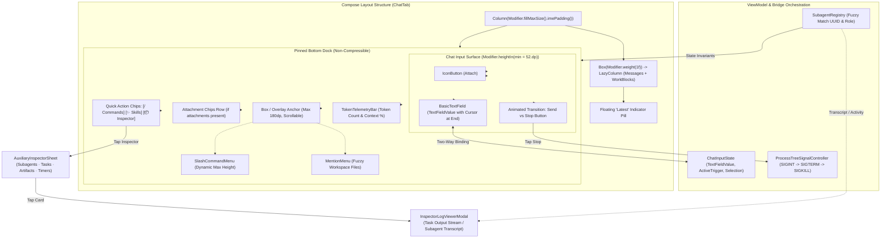
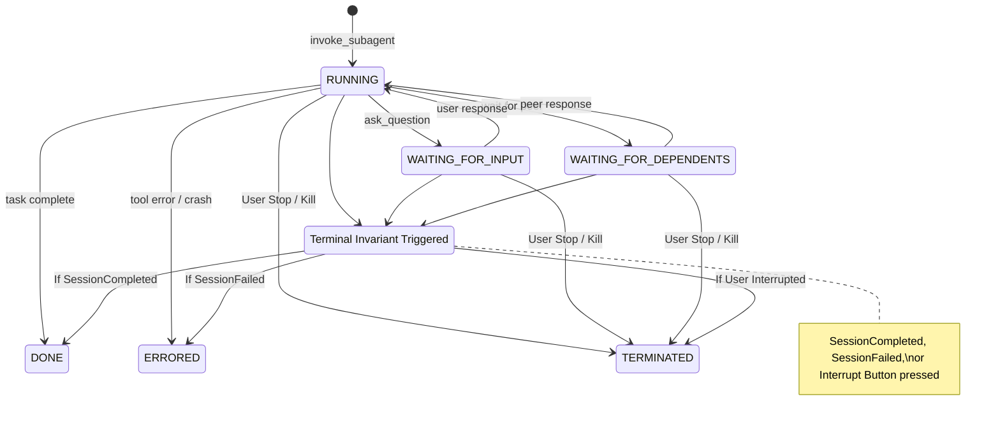
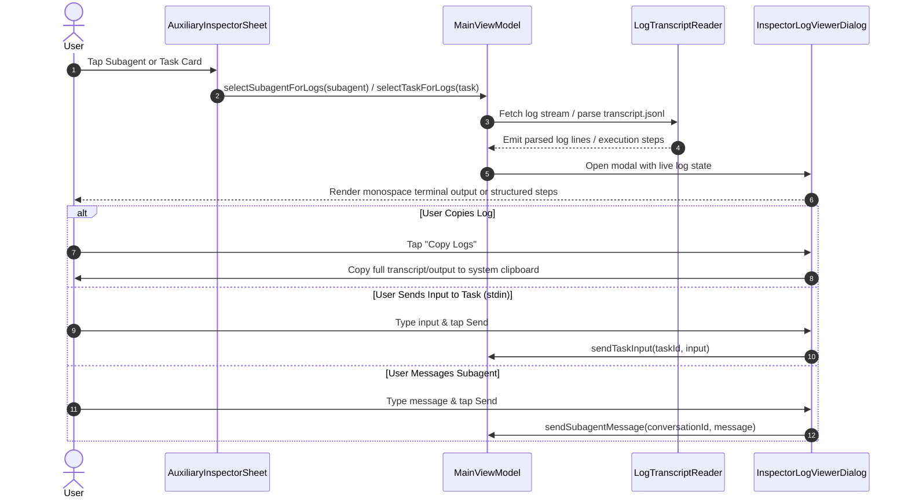
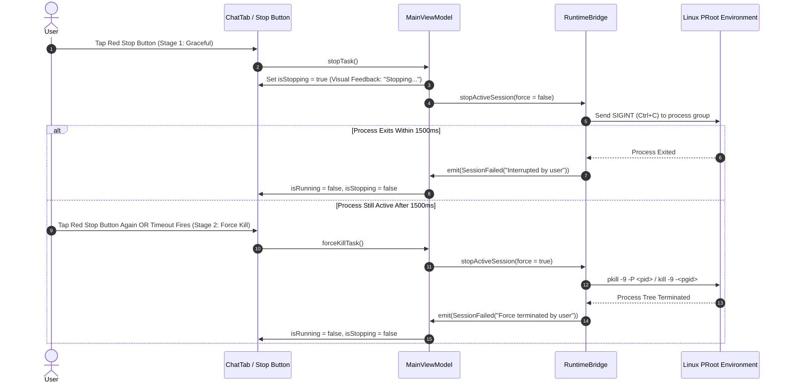

# Product Requirements Document (PRD)
## Mobile Chatbox Layout Stability, Cursor Precision, Subagent Lifecycle & Robust Interrupt Engine

**Document Version:** 1.0.0  
**Status:** Approved for Implementation  
**Target Release:** Mobile Harness v2026.11  
**Target Platform:** Android (ARM64 PRoot Linux Runtime · Jetpack Compose · Material 3)  
**Target Workspace:** `/workspace/clever-kalam`  
**Affected Subsystems:**  
- `app/src/main/java/com/jarves/mh/ui/PocketDevApp.kt` (Chat layout, IME insets, chat bar constraints, `TextFieldValue` cursor handling)
- `app/src/main/java/com/jarves/mh/ui/CliParityComponents.kt` (SlashCommandMenu, MentionMenu, AuxiliaryInspectorSheet)
- `app/src/main/java/com/jarves/mh/ui/MainViewModel.kt` (Prompt trigger regex, subagent lifecycle invariants, task interruption)
- `app/src/main/java/com/jarves/mh/runtime/AntigravityRuntimeBridge.kt` (Subagent event fuzzy matching, process group tree signals)
- `app/src/main/java/com/jarves/mh/runtime/RuntimeBridge.kt` (Interrupt protocol, process kill semantics)
- `app/src/main/java/com/jarves/mh/model/Models.kt` (Subagent state transitions, Task termination models)

---

## 1. Executive Summary & Root Cause Analysis

### 1.1 Context
Mobile Harness (`mh`) provides developers on Android with a fully native Jetpack Compose interface over local PRoot Linux coding engines: Google Antigravity CLI (`agy`), Anthropic Claude Code (`claude`), and DeepSeek Harness (`dsh`). 

Following the implementation of CLI feature parity (Slash Commands, Skills System, and Auxiliary Inspector), real-world device testing revealed critical layout, cursor, subagent lifecycle, and task interruption defects. This document outlines the technical requirements, design patterns, and implementation strategy to resolve these issues and deliver essential mobile quality-of-life (QoL) improvements.

---

### 1.2 Problem Statements & Technical Root Causes

#### Problem 1: Chatbox Collapses / Squished into Tiny Sliver (~8dp) When Typing Commands
- **Symptom:** As seen in device telemetry and screenshots, when the user types `/`, the `SlashCommandMenu` appears, and the entire chat input container is squeezed down to an unusable 8–10dp height strip, hiding the text field and squishing the send/attachment buttons.
- **Root Cause:**
  1. In `PocketDevApp.kt`, `ChatTab` uses `Column(Modifier.fillMaxSize().imePadding())`.
  2. Inside this Column, the messages list is placed in `Box(Modifier.weight(1f))`, while the bottom panel is an unweighted `Surface` containing the attachment list, `SlashCommandMenu`, `TokenTelemetryBar`, quick action chips, and the chatbox `Surface`.
  3. When the soft keyboard (Gboard) opens, available viewport height drops from ~800dp to ~350dp.
  4. `SlashCommandMenu` renders an inline `LazyColumn` with `.heightIn(max = 240.dp)`. With chips (~40dp) and telemetry (~24dp), the bottom Column requires over 360dp of vertical space.
  5. The chat input `Surface` lacks a non-negotiable minimum height constraint (`Modifier.heightIn(min = 52.dp)`). When the available space is smaller than the intrinsic minimum of the children, Compose's layout engine flex-compresses the input field and its parent `Surface` into a crushed sliver.

#### Problem 2: Cursor Remains Trapped at Position 1 After Selecting a Slash Command
- **Symptom:** When a user selects a command from the options popup (e.g. `/boost`), the text field updates to `"/boost "`, but the text cursor does not move to the end; it stays at index 1 (immediately after `/`). The user is forced to manually tap the end of the text before typing their prompt.
- **Root Cause:**
  1. `ChatTab` binds `BasicTextField` to a raw `String` primitive (`prompt: String`, `onPromptChanged: (String) -> Unit`) rather than Compose's `TextFieldValue`.
  2. In Jetpack Compose, updating a `BasicTextField` backed by a plain `String` preserves the previous selection offset index. Because the user had typed `/` (a 1-character string with cursor at index 1), updating `prompt` to `"/boost "` preserves selection offset 1.
  3. Without explicit `TextRange(selection)` management, programmatic text insertions cannot position the cursor at the trailing boundary.

#### Problem 3: Slash Commands and Skills Invisible When Text Already Exists in Input
- **Symptom:** Typing `/` only displays commands if the chat input was previously empty. If text is already typed (e.g., "Please fix this and run /" or "can you /plan"), no command popup appears.
- **Root Cause:**
  1. `MainViewModel.onPromptChanged(newPrompt)` checks strict string prefixes:
     ```kotlin
     if (newPrompt.startsWith("/")) { ... }
     ```
  2. Query extraction relies on `newPrompt.substring(1).substringBefore(" ")` and `!newPrompt.contains(" ")`. Any leading text or existing whitespace immediately disables the slash command detection.

#### Problem 4: Subagents Stuck in `RUNNING` Status in Inspector (Zombie Subagents)
- **Symptom:** In the Auxiliary Inspector Sheet, subagents like "Codebase Inspector" remain indefinitely in `RUNNING` status even after the agent turn has completed or failed.
- **Root Cause:**
  1. **UUID vs Role Mismatch:** Antigravity CLI assigns a UUID conversation ID (e.g. `6d3b8825-...`) to invoked subagents. However, `AntigravityEventParser` generates synthetic IDs (e.g. `subagent-1` or `subagent-codebase-researcher-1`). When subsequent lifecycle events arrive with the real UUID or role name, the parser fails to find a match, creating orphan/duplicate records.
  2. **Incomplete Terminal Invariants:** On `SessionCompleted` or `SessionFailed`, `MainViewModel` only transitions subagents where `state == SubagentState.RUNNING`. Subagents in intermediate states (`WAITING_FOR_INPUT`, `WAITING_FOR_DEPENDENTS`, `IDLE`) are skipped and remain stuck forever.
  3. **Lack of In-Sheet Controls:** Users could not manually terminate a subagent or purge finished records from the UI.

#### Problem 5: Interrupt / Stop Button Fragility & Lingering Processes
- **Symptom:** Pressing the red Stop button (`Icons.Default.Stop`) sometimes leaves the UI in a running state, or stops the parent session while background Linux processes (e.g. Gradle builds, test runners, Python scripts) continue executing and draining battery/CPU in PRoot.
- **Root Cause:**
  1. `RuntimeBridge.stopActiveSession()` calls `activeProcess?.destroy()`, which only sends `SIGTERM` to the immediate PRoot shell wrapper without terminating the child process tree or process group.
  2. UI state updates depend on asynchronous `emitFailure("Stopped by user")` from the bridge. If the process is blocked on I/O, the UI remains in `isRunning = true` without visual acknowledgement.
  3. No two-stage interruption (Graceful cancellation vs Force Kill).

#### Problem 6: Inspector Cards are Static & Opaque (No In-App Log/Transcript Viewer for Subagents & Tasks)
- **Symptom:** In the Auxiliary Inspector Sheet, tapping on an active or finished subagent card or background task card produces no response. Developers cannot view execution logs, terminal stdout/stderr, compilation output, tool call arguments, or subagent conversation transcripts (thinking steps, tool results) inside the mobile UI without navigating PRoot Linux terminal paths manually.
- **Root Cause:**
  1. **Non-Interactive Cards:** Cards in `SubagentsView` and `BackgroundTasksView` (`CliParityComponents.kt`) do not have click modifiers or visual affordances indicating they can be inspected.
  2. **Missing Inspector Log Viewer UI:** No dedicated modal sheet or dialog exists to inspect task logs (`BackgroundTaskInfo.logFilePath` / `liveOutputTail`) or subagent transcripts (`SubagentInfo.transcriptPath` / `transcript.jsonl`).
  3. **No Reactive Log Streaming Protocol:** The view model lacks state binding to track the currently selected task/subagent for inspection and stream live output updates to the UI.

---

## 2. System Architecture & Visual Design

### 2.1 Interaction & Component Hierarchy



---

## 3. Pillar-by-Pillar Feature Specifications

### 3.1 Pillar 1: Chatbox Layout Resilience & Anti-Compression

#### 3.1.1 Structural Constraints
1. **Chat Input Non-Negotiable Height:**
   The chat input container `Surface` must have a rigid minimum height:
   ```kotlin
   Modifier
       .fillMaxWidth()
       .heightIn(min = 52.dp)
   ```
   Under no circumstances (whether keyboard is open, slash menu is open, or screen is split) can this container flex below 52dp.

2. **Adaptive Max-Height for Slash & Mention Popups:**
   Instead of a hardcoded `240.dp` height that collides with the soft keyboard, `SlashCommandMenu` and `MentionMenu` must calculate their maximum allowable height dynamically based on the local configuration:
   ```kotlin
   val configuration = LocalConfiguration.current
   val screenHeightDp = configuration.screenHeightDp.dp
   val maxMenuHeight = (screenHeightDp * 0.28f).coerceIn(120.dp, 190.dp)
   ```
   This ensures the menu never consumes more than 28% of the visible viewport, leaving ample room for the message stream and the input container.

3. **Overlay Anchor Architecture:**
   The `SlashCommandMenu` and `MentionMenu` must be wrapped in an elevated container placed directly above the action chips, using intrinsic height or an overlay layout to prevent pushing the text box downwards off the screen.

4. **Soft Keyboard Inset Integration:**
   Remove redundant padding calls. Use `WindowInsets.ime` and `WindowInsets.isImeVisible` to animate transitions cleanly when the keyboard appears or disappears.

---

### 3.2 Pillar 2: Cursor Precision & `TextFieldValue` State Management

#### 3.2.1 State Migration to `TextFieldValue`
Migrate `ChatTab` from `prompt: String` to `inputState: TextFieldValue`:
```kotlin
data class ChatInputState(
    val value: TextFieldValue = TextFieldValue(""),
    val activeTrigger: TriggerKind? = null,
    val triggerQuery: String = "",
)

enum class TriggerKind { SLASH_COMMAND, FILE_MENTION }
```

#### 3.2.2 End-of-Text Selection Guarantees
When a user selects an item from `SlashCommandMenu` or `MentionMenu`:
1. **Local Commands without Arguments** (e.g. `/clear`, `/help`, `/cost`):
   Immediately dispatch command to `onSend(cmd.syntax)` and reset `inputState` to `TextFieldValue("")`.
2. **Commands with Arguments** (e.g. `/plan <task>`, `/boost <prompt>`, `/model <name>`):
   Replace the trigger token with `${cmd.syntax} ` and explicitly position the cursor at the end:
   ```kotlin
   val newText = "${cmd.syntax} "
   inputState = TextFieldValue(
       text = newText,
       selection = TextRange(newText.length) // Cursor strictly at end
   )
   ```
3. **Mid-Text Command Insertion:**
   When `/` is typed mid-sentence, replace only the active trigger segment up to the cursor:
   ```kotlin
   val beforeTrigger = text.substring(0, triggerStartIndex)
   val afterCursor = text.substring(cursorIndex)
   val newText = "$beforeTrigger${cmd.syntax} $afterCursor"
   val newCursorPos = beforeTrigger.length + cmd.syntax.length + 1
   inputState = TextFieldValue(text = newText, selection = TextRange(newCursorPos))
   ```

---

### 3.3 Pillar 3: Contextual Command & Mention Trigger Engine

#### 3.3.1 Boundary-Aware Trigger Regex
Slash commands must activate both at the beginning of the text AND after whitespace:
```kotlin
// Matches "/command" at start of line or preceded by whitespace
val slashRegex = Regex("""(?:^|\s)/([a-zA-Z0-9_-]*)$""")

// Matches "@query" at start of line or preceded by whitespace
val mentionRegex = Regex("""(?:^|\s)@([a-zA-Z0-9_./-]*)$""")
```

#### 3.3.2 Behavior Matrix

| User Input State | Cursor Position | Trigger Detected | UI Behavior |
| :--- | :--- | :--- | :--- |
| `""` | 0 | None | Popups hidden. Chips visible. |
| `"/"` | 1 | Slash (`""`) | `SlashCommandMenu` displays all commands. |
| `"/pl"` | 3 | Slash (`"pl"`) | `SlashCommandMenu` filtered to `/plan`. |
| `"/plan "` | 6 (after space) | None | Popups dismiss. Text box shows inline hint `"<task description>"`. |
| `"Please /"` | 8 | Slash (`""`) | `SlashCommandMenu` displays all commands. |
| `"Please /rev"` | 11 | Slash (`"rev"`) | `SlashCommandMenu` filtered to `/review`. |
| `"Check @"` | 7 | Mention (`""`) | `MentionMenu` displays recent project files. |
| `"Check @Main"` | 11 | Mention (`"Main"`) | `MentionMenu` filtered to matching files (`MainActivity.kt`, etc.). |

---

### 3.4 Pillar 4: Subagent Lifecycle, Fuzzy Matching & Inspector Controls

#### 3.4.1 Fuzzy Matching Subagent Registry
To eliminate zombie and duplicated subagents caused by UUID vs Role differences:
1. When `invoke_subagent` begins, register `SubagentInfo` with role, type, prompt, and temporary ID.
2. When backend updates or transcript entries arrive with a UUID `conversationId`:
   - Match by `conversationId` first.
   - If no match, match by `role` where `state == SubagentState.RUNNING`.
   - Update the existing record with the official `conversationId` instead of creating an orphaned duplicate.

#### 3.4.2 State Transition Invariants
All subagents and background tasks MUST adhere to strict terminal state guarantees:



#### 3.4.3 Auxiliary Inspector Sheet Enhancements
1. **Interactive Stop Button Per Subagent:** Each active subagent card in `AuxiliaryInspectorSheet` must display an individual `Stop` button calling `manage_subagents(kill, ConversationIds=[id])`.
2. **Clear Finished / Errored Button:** A top-level action button to remove all terminal (`DONE`, `ERRORED`, `TERMINATED`) subagents and tasks with a single tap.
3. **Live Elapsed Timer & Activity Pulse:** Subagents in `RUNNING` state display an animated pulsing dot and a live elapsed timer (`00:42s`).
4. **Click-to-Inspect Card Affordance:** Cards display an inspection affordance (subtle chevron `Icons.AutoMirrored.Filled.NavigateNext` or log icon, and ripple feedback) to launch detailed log/transcript inspection modal.

#### 3.4.4 Interactive Subagent Transcript & Task Log Viewer Modal Specification

Tapping any Subagent card in `SubagentsView` or Background Task card in `BackgroundTasksView` opens an in-app log inspection dialog or modal sheet (`InspectorLogViewerDialog`), providing instant deep visibility into subagent reasoning and background process execution.



##### 1. Background Task Terminal Log Viewer (`TaskLogViewerDialog`)
- **Metadata Header:**
  - **Task ID & Status:** Bold monospace identifier (e.g. `task-102`) paired with color-coded status badge (`RUNNING`, `COMPLETED`, `FAILED`, `TERMINATED`).
  - **Invoked Command:** Monospace container showing the exact shell command (e.g. `./gradlew assembleOnlineDebug`), with a 1-tap "Copy Command" button.
  - **Working Directory (`cwd`):** Full path to execution root (e.g. `/workspace/clever-kalam`).
  - **Execution Duration & Exit Code:** Live runtime counter (e.g. `Elapsed: 01:24s`) and final exit code (e.g. `Exit: 0` or `Exit: 137`).
- **Terminal Console Container:**
  - Dark high-contrast console background (`Color(0xFF1E1E1E)`) with monospace font (`FontFamily.Monospace`, 11sp, color `#E0E0E0`).
  - Real-time output stream: displays `BackgroundTaskInfo.liveOutputTail` or reads content from `BackgroundTaskInfo.logFilePath` (up to 2,000 trailing lines).
  - Sanitization: ANSI escape sequences filtered or styled for mobile legibility.
  - Sticky auto-scroll to bottom, with automatic scroll-lock detection when the user manually scrolls up to inspect previous output.
- **Interactive Actions:**
  - **Copy All Logs:** One-tap button to copy entire console output to the Android clipboard.
  - **Interactive Stdin Bar:** For active running tasks, an inline text field allowing the user to send stdin text via `manage_task(send_input, Input=...)`.
  - **Terminate Button:** Individual red stop button to kill the task via `manage_task(kill, TaskId=...)`.

##### 2. Subagent Transcript & Task Log Dialog (`SubagentTranscriptViewerDialog`)
- **Subagent Identity Header:**
  - **Role & Type:** Human-readable title (e.g. "Codebase Researcher") and base type (`research`, `self`, custom).
  - **Conversation ID:** Full UUID and shortened identifier (e.g. `6d3b8825-...`).
  - **State & Timing:** Status badge (`RUNNING`, `WAITING_FOR_INPUT`, `WAITING_FOR_DEPENDENTS`, `DONE`, `ERRORED`), start timestamp, and total duration.
- **Dual View Modes (Tabs):**
  - **Tab A: Formatted Execution Steps (`Steps View`):**
    - Parses JSONL entries from `<appDataDir>/brain/<conversationId>/.system_generated/logs/transcript.jsonl`.
    - **`THINKING` Blocks:** Collapsible accordions with muted, italicized text showing the subagent's internal reasoning.
    - **`TOOL_CALL` Blocks:** Distinct syntax cards showing tool name (e.g. `view_file`, `replace_file_content`, `run_command`), along with formatted parameter key-values.
    - **`TOOL_RESULT` Blocks:** Monospace expandable output containers displaying stdout, file diffs, or error payloads.
    - **`MODEL_RESPONSE` Blocks:** Markdown-rendered assistant responses emitted by the subagent.
  - **Tab B: Raw JSONL Log (`Raw JSONL View`):**
    - Monospace, line-numbered raw JSONL text stream for low-level debugging and auditing.
    - Copy single step or entire raw log.
- **Subagent Controls:**
  - **Copy Transcript:** Copies formatted or raw transcript to Android clipboard.
  - **Send Message:** Input bar to send follow-up instructions via `send_message(Recipient=conversationId, Message=...)`.
  - **Stop Subagent:** Force termination via `manage_subagents(kill, ConversationIds=[id])`.

---

### 3.5 Pillar 5: Robust Two-Stage Interrupt Engine

#### 3.5.1 Two-Stage Signal Escalation
Stopping an AI agent task or background build on mobile must never hang:



#### 3.5.2 Immediate UI Feedback
1. When the user taps the Stop button:
   - The button icon changes to an animated spinner or "Halting" pulse.
   - The button is disabled for 300ms to debounce accidental multi-clicks.
   - All active subagents and tasks are immediately marked as `TERMINATED` locally in UI state so the Inspector updates without lag.
2. **WorkBlock Retention Guarantee:**
   The active work segment is finalized as an "Interrupted Work Block" with total elapsed seconds (`"Task stopped after 34s"`). No thinking blocks or tool outputs generated prior to the interruption are lost.

---

### 3.6 Pillar 6: Suggested Quality-of-Life (QoL) Suite

1. **Floating "Latest / Scroll-to-Bottom" Indicator:**
   When the user scrolls up in the chat stream during active generation, a floating pill button (`"Latest ↓"`) appears at the bottom center with unread message badges. Tapping it smoothly animates scroll to the bottom.
2. **Quick Action Pills Bar:**
   Directly above the chat input, persistent shortcut chips provide 1-tap access:
   - `[/ Commands]` (Toggles slash commands menu)
   - `[✨ Skills]` (Opens Skills & Rules Hub sheet)
   - `[📦 Inspector (N)]` (Opens Inspector with active count badge)
   - `[⚡ Checkpoint]` (Quick local workspace snapshot)
3. **Token Telemetry & Context Bar:**
   Displays live session context stats above the input bar:
   `14.2k tokens (12% of 200k) · 48 tok/s · 2.1s latency`
4. **Haptic Feedback:**
   Trigger subtle haptic vibrations (`HapticFeedbackType.LongPress` / `TextHandleMove`) when:
   - Selecting a slash command or mention item
   - Tapping the Stop / Interrupt button
   - Completing an agent task

---

## 4. Data Models & API Contracts

### 4.1 Enhanced Input & Trigger Models
```kotlin
package com.jarves.mh.model

import androidx.compose.ui.text.input.TextFieldValue

enum class TriggerType {
    NONE,
    SLASH_COMMAND,
    FILE_MENTION,
}

data class InputTriggerState(
    val type: TriggerType = TriggerType.NONE,
    val query: String = "",
    val triggerStartIndex: Int = -1,
)

data class ChatInputState(
    val textFieldValue: TextFieldValue = TextFieldValue(""),
    val triggerState: InputTriggerState = InputTriggerState(),
    val isStopping: Boolean = false,
)
```

### 4.2 Subagent Lifecycle State Machine
```kotlin
package com.jarves.mh.model

enum class SubagentState {
    RUNNING,
    WAITING_FOR_INPUT,
    WAITING_FOR_DEPENDENTS,
    IDLE,
    DONE,
    ERRORED,
    TERMINATED;

    val isTerminal: Boolean
        get() = this == DONE || this == ERRORED || this == TERMINATED
}

data class SubagentInfo(
    val conversationId: String,
    val role: String,
    val typeName: String,
    val state: SubagentState,
    val currentActivity: String = "",
    val transcriptPath: String? = null,
    val startedAtMillis: Long = System.currentTimeMillis(),
    val finishedAtMillis: Long? = null,
    val error: String? = null,
) {
    fun matches(targetId: String, targetRole: String? = null): Boolean {
        if (conversationId == targetId || targetId == "*") return true
        if (targetRole != null && role.equals(targetRole, ignoreCase = true)) return true
        return false
    }
}
```

### 4.3 Runtime Interrupt Contract
```kotlin
package com.jarves.mh.runtime

interface RuntimeBridge {
    // Existing functions...
    suspend fun stopSession(sessionId: String, force: Boolean = false)
    suspend fun stopActiveSession(force: Boolean = false)
    suspend fun terminateSubagent(sessionId: String, conversationId: String): Boolean
    suspend fun terminateBackgroundTask(sessionId: String, taskId: String): Boolean
}
```

---

## 5. Implementation Roadmap & Verification Plan

### Milestone 1: Chatbox Layout Resilience & Height Enforcement
- [ ] Add `Modifier.heightIn(min = 52.dp)` to chat input `Surface` in `PocketDevApp.kt`.
- [ ] Implement adaptive height constraints on `SlashCommandMenu` and `MentionMenu` (`maxMenuHeight`).
- [ ] Wrap popup menus in an anchored Box container to prevent pushing the input bar downwards.
- [ ] Test on 3 device aspect ratios and split-screen mode with Gboard active.

### Milestone 2: `TextFieldValue` Migration & End-of-Text Selection
- [ ] Refactor `ChatTab` state from `var prompt by rememberSaveable` to `var inputState by rememberSaveable(stateSaver = TextFieldValue.Saver)`.
- [ ] In `SlashCommandMenu.onSelect`, construct `TextFieldValue` with `TextRange(newText.length)`.
- [ ] Implement mid-sentence replacement logic for both slash commands and file mentions.
- [ ] Verify cursor is placed at the end with a trailing space on every command selection.

### Milestone 3: Contextual Trigger Regex & Mid-Text Support
- [ ] Update `MainViewModel.onPromptChanged` to parse triggers via regex:
  - Supports `/` at start of line or preceded by space.
  - Supports `@` at start of line or preceded by space.
- [ ] Ensure query extraction correctly takes only the substring between trigger character and cursor position.
- [ ] Verify typing text before `/` properly opens the slash commands menu.

### Milestone 4: Subagent Lifecycle, Interactive Inspector & Log/Transcript Viewers
- [ ] Update `AntigravityEventParser` to match subagents by `conversationId` or `role`.
- [ ] Enforce terminal state transition in `MainViewModel`:
  - On `SessionCompleted`, all non-terminal subagents -> `DONE`.
  - On `SessionFailed`, all non-terminal subagents -> `ERRORED`.
  - On `stopTask()`, all non-terminal subagents -> `TERMINATED`.
- [ ] Add per-card Stop button and "Clear finished" action in `AuxiliaryInspectorSheet`.
- [ ] Implement card tap interactions in `SubagentsView` and `BackgroundTasksView` with ripple feedback and navigation chevron.
- [ ] Build `TaskLogViewerDialog` to display live terminal output stream (`liveOutputTail` / `logFilePath`), exit codes, auto-scroll toggle, copy to clipboard, and stdin injection.
- [ ] Build `SubagentTranscriptViewerDialog` with dual tabs: formatted execution steps (collapsible thinking blocks, tool calls, tool results) and raw JSONL transcript viewer.
- [ ] Connect `MainViewModel` to manage selected log inspection states (`selectedSubagentForLogs`, `selectedTaskForLogs`).

### Milestone 5: Two-Stage Interrupt Engine & Process Tree Killing
- [ ] Update `NativeSpawnProcess` and `RuntimeBridge` to execute `pkill -P <pid>` or kill the PRoot process group.
- [ ] Add stage 1 (graceful cancel) and stage 2 (force kill) states with immediate visual feedback on the stop button.
- [ ] Ensure work segment is finalized as "Task interrupted" without losing activity history.

### Milestone 6: Build Verification & Testing
- [ ] Kotlin Compilation:
  ```bash
  ./gradlew :app:compileOnlineDebugKotlin
  ```
- [ ] Unit Test Suite:
  ```bash
  ./gradlew :app:testOnlineDebugUnitTest
  ```
- [ ] APK Assembly & Packaging:
  ```bash
  ./gradlew assembleOnlineDebug
  cp -f app/build/outputs/apk/online/debug/app-online-debug.apk app-online-debug.apk
  cp -f app-online-debug.apk mobile-harness-dev.apk
  stat -c "%s %n" *.apk
  md5sum *.apk
  ```

---

## 6. Success Metrics & Acceptance Criteria

1. **Zero Input Squeezing:** Chat input container remains at or above 52dp height under all conditions (IME open, slash menu open, split screen).
2. **100% Cursor Accuracy:** Selecting any command or mention places the cursor at the end of the newly inserted token with a single trailing space.
3. **Omnipresent Triggering:** Typing `/` or `@` anywhere in the prompt (at start or preceded by whitespace) displays the corresponding suggestion menu.
4. **Zero Zombie Subagents:** 100% of subagents transition to terminal states (`DONE`, `ERRORED`, `TERMINATED`) upon session end or task interruption.
5. **Instantaneous Stop Responsiveness:** Tapping the stop button provides visual feedback within 50ms and halts running agent processes cleanly within 1500ms.
6. **One-Tap Task & Subagent Log Inspection:** 100% of subagent and background task cards in the Inspector sheet open their detailed log/transcript modal upon tap, rendering real-time terminal stdout/stderr, thinking steps, and tool execution history with 1-tap clipboard copying.
7. **Binary Parity & Clean Builds:** All unit tests pass, and debug APKs assemble with valid signatures.
