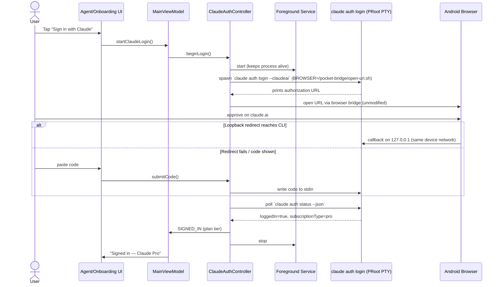
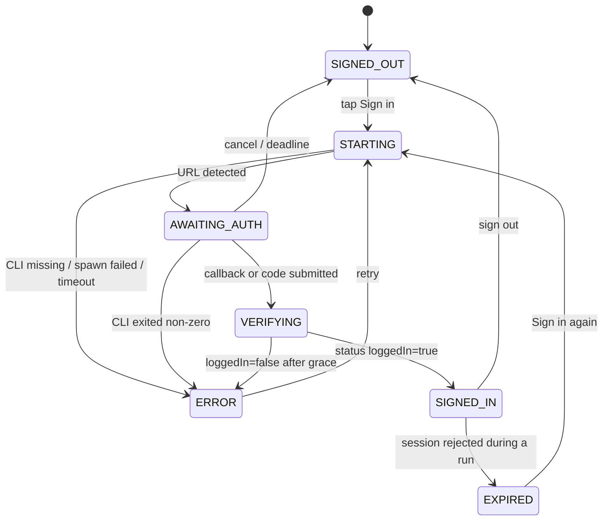

# Product Requirements Document (PRD)
## Sign in with Claude.ai — Native Account Login for Claude Code in Mobile Harness

**Document Version:** 1.0.0
**Status:** Draft for review
**Target Platform:** Android (ARM64 PRoot Linux runtime)
**Affected Subsystems:** `runtime/ClaudeAuthController`, `runtime/AndroidBrowserBridge`, `runtime/ClaudeRuntimeBridge`, `ui/AgentScreen`, `ui/PocketDevApp` (onboarding), `ui/MainViewModel`, `model/Models.kt`
**Related Docs:** `PRD_ANTIGRAVITY_SERVER_OAUTH_HARNESS_BRIDGE.md` (same "CLI owns OAuth" principle)

---

## 1. Summary

### 1.1 Problem
A Claude Pro/Max/Team/Enterprise subscriber who wants to use Claude Code inside Mobile Harness must today:
1. find a **separate computer** with Claude Code installed,
2. run `claude setup-token`,
3. copy a long-lived token to the phone,
4. paste it into the app.

This is the only login path visible in the app (`AgentScreen.kt` shows "Run `claude setup-token` on a computer signed in to your Claude subscription…"). It defeats the point of a mobile-first harness and is the main onboarding blocker for Claude users.

### 1.2 Solution
Add a one-tap **"Sign in with Claude"** flow that signs the user's own Claude.ai account into the Claude Code CLI that already runs inside the app's PRoot runtime, using the CLI's own OAuth flow (`claude auth login --claudeai`). The user taps a button, approves in their phone browser, and returns to the app signed in, with no second device and no token copying.

### 1.3 Guiding principle (non-negotiable)
**Claude Code owns OAuth.** Mobile Harness orchestrates the official CLI and observes non-secret status. It does **not**:
- implement its own OAuth client, reuse Anthropic's client ID, or build authorization URLs,
- read, copy, parse, log, back up, or transmit tokens or the contents of `/root/.claude/.credentials.json`,
- modify URL parameters (PKCE `state`/`code_challenge`) produced by the CLI.

This keeps the integration on the sanctioned path (the official CLI signing in with the user's own subscription) and keeps token handling, refresh, and revocation inside software Anthropic maintains.

---

## 2. Goals and Non-Goals

### 2.1 Goals
| ID | Goal |
|---|---|
| G1 | A signed-out user can sign in with a Claude.ai account on the phone alone, in ≤ 3 taps plus the browser consent screen. |
| G2 | Sign-in state is accurate and survives app backgrounding, process death, and app restarts. |
| G3 | The flow works when the browser callback cannot reach the app (manual code paste fallback). |
| G4 | The user can see who/what they are signed in as (plan tier), sign out, and re-authenticate when the session expires. |
| G5 | Agent sessions on a signed-in account need no API key or setup token and fail with a clear, actionable message when auth is missing or expired. |
| G6 | The existing setup-token path stays available as a fallback. |

### 2.2 Non-Goals
- Custom or reimplemented Anthropic OAuth, or any token extraction (see 1.3).
- Anthropic Console / API-key billing login (`claude auth login --console`). API keys remain handled by the existing provider key vault.
- Multi-account rotation for Claude (the Antigravity-style account pool). One Claude account at a time in v1.
- Using the Claude subscription for DeepSeek Harness or Antigravity runtimes.
- Changing execution/permission behaviour of Claude Code sessions.

---

## 3. Current State (verified from code at `3f788bb`)

The backend is largely built; **the user-facing flow is missing and the backend has reliability gaps.**

| Capability | Status | Where |
|---|---|---|
| Run `claude auth login --claudeai` in a PTY | Exists | `ClaudeAuthController.beginLogin()` |
| Detect auth URL from CLI output, open browser | Exists (see gap B3 on host allowlist) | `extractOAuthUrl()`, `AndroidBrowserBridge`, `MainViewModel` collector |
| Browser handoff from inside PRoot (`BROWSER`, `xdg-open` shim) | Exists | `AndroidBrowserBridge.ensureBridgeInstalled/watch` |
| Manual code submission to the CLI's stdin | Exists | `submitCode()` / `MainViewModel.submitClaudeCode()` |
| Status via `claude auth status --json` (non-secret metadata) | Exists | `queryAuthStatus()`, `ClaudeStatusMetadata` |
| Sign out via `claude auth logout` | Exists | `ClaudeAuthController.logout()` |
| ViewModel API + state (`claudeAuth`, `claudeAuthMode`) | Exists | `MainViewModel.startClaudeLogin/cancelClaudeLogin/logoutClaude/setClaudeAuthMode/refreshClaudeAuthStatus` |
| Runtime launch without API env in native mode | Exists | `RuntimeLaunchConfigBuilder`, `ClaudeRuntimeBridge` (`NATIVE_SUBSCRIPTION`) |
| Unit tests for env/status/URL/sanitizing | Exists | `ClaudeNativeAuthTest` |
| **UI that calls any of the above** | **Missing** | No composable references `startClaudeLogin`, `claudeAuth`, or `claudeAuthMode` |
| Onboarding step for Claude login | **Missing** | Onboarding shows only the setup-token paste screen (`PocketDevApp.kt` ~3165) |

### 3.1 Backend gaps this PRD must close
| ID | Gap | Impact |
|---|---|---|
| B1 | **No foreground service during login.** The login runs in a child process while the user is in the browser; Android may freeze or kill a backgrounded app. | Login dies mid-flow, user returns to a dead session. |
| B2 | **Success is detected by matching CLI text** ("Logged in", "Authentication successful"). | Brittle across CLI versions; can hang or misreport. |
| B3 | **URL allowlist is `claude.com` / `platform.claude.com` only.** The host the CLI actually emits for `--claudeai` must be confirmed on device (it may be `claude.ai`). | If the host differs, no URL is detected and the browser never opens. |
| B4 | **No timeout or overall deadline** on `beginLogin()`; the loop polls until the process exits. | Stuck "Waiting for authorization…" forever. |
| B5 | **No state restoration** after process death mid-login, and no re-check on app resume. | Wrong "signed out" UI after returning from the browser. |
| B6 | **Concurrent-run guard is weak**: `startClaudeLogin` returns silently if an agent is running/installing. | Button appears dead with no explanation. |
| B7 | **Auth failures during a coding session** are mapped to text ("Use Sign in with Claude") but nothing in the UI performs it. | Dead-end error message. |
| B8 | **Credential file location is shared**: `/root/.claude/.credentials.json` is inside the rootfs that every agent process (and any command the agent runs) can read. | Token exposure to agent-run code. See §8. |

---

## 4. User Stories and Flows

### 4.1 Personas
- **Subscriber on phone only** (primary): has a Claude Pro/Max plan, no computer nearby.
- **Existing setup-token user**: already pasted a token; must not be broken or forced to migrate.
- **Team/Enterprise user**: org policy may restrict claude.ai login; needs a clear error.

### 4.2 Stories
1. *As a new user*, I pick "Claude Code", tap **Sign in with Claude**, approve in my browser, and land back in the app ready to code.
2. *As a user whose browser cannot redirect back*, I copy the code shown by Claude and paste it into the app to finish.
3. *As a signed-in user*, I see "Signed in — Claude Pro" and can sign out or switch accounts.
4. *As a user whose session expired mid-task*, I get a clear prompt with a one-tap **Sign in again** and my task can be retried.
5. *As a setup-token user*, I can keep using my token, or switch to account login, without losing either.

### 4.3 Primary flow

### 4.4 Auth state machine

`VERIFYING` and `EXPIRED` are new states added to `ClaudeAuthStatusState`.

---

## 5. Functional Requirements

### 5.1 UI
| ID | Requirement |
|---|---|
| UI-1 | **Agent screen, Claude Code tab:** when `provider.kind == CLAUDE`, show a primary **Sign in with Claude** card whose content depends on `claudeAuth.status` (signed out / starting / awaiting / verifying / signed in / error / expired). Setup-token entry moves under an **Advanced: use a setup token** disclosure; it is not removed. |
| UI-2 | **Onboarding:** the Claude step leads with **Sign in with Claude**; "Use a setup token instead" is a secondary link. Onboarding completes via `finishClaudeOnboarding()` only after `SIGNED_IN`. |
| UI-3 | **Awaiting state:** show the exact message, a **Reopen browser** button (re-opens the same detected URL), a **Copy link** button, a masked **Paste code** field with **Submit**, and **Cancel**. |
| UI-4 | **Signed-in state:** "Signed in — Claude {Pro/Max/Team/Enterprise}", with **Sign out** and **Refresh status**. Never display tokens, emails derived from credential files, or the URL after completion. |
| UI-5 | **Error state:** human-readable cause + one primary action (Retry / Install Claude Code / Sign in again). |
| UI-6 | The header badge ("Not tested") reflects auth status for Claude, not a stale ping result. |
| UI-7 | If Claude Code is not installed, the button label is **Install & sign in**, and installing proceeds into login automatically (today `startClaudeLogin` installs and then stops). |
| UI-8 | All controls ≥ 48 dp touch targets; strings in resources; state announced to TalkBack. |

### 5.2 Login orchestration (`ClaudeAuthController`)
| ID | Requirement |
|---|---|
| LG-1 | Run login inside a **foreground service** (reuse `RuntimeSetupService`/`RuntimeExecutionService` pattern, `specialUse`) with a notification "Signing in to Claude", started before spawning the CLI and stopped on any terminal state (fixes B1). |
| LG-2 | Hard **deadline of 10 minutes** for the whole flow; on expiry kill the process group, return to `SIGNED_OUT` with "Sign-in timed out" (fixes B4). |
| LG-3 | **Completion is determined by `claude auth status --json`**, polled (≤ 1 s interval, bounded) after the CLI exits or after a code is submitted. CLI text matching may be used only as an early hint, never as the success criterion (fixes B2). |
| LG-4 | **URL allowlist** is an explicit constant set of HTTPS hosts, confirmed against real CLI output before release (fixes B3). A URL outside the set is **not opened** and surfaces an error. The URL is passed to the browser byte-for-byte. |
| LG-5 | **Single flight:** a second `beginLogin()` while one is running is ignored with a visible state, not a silent return (fixes B6). |
| LG-6 | `cancelLogin()` kills the entire process group (SIGTERM → SIGKILL after grace) and removes the PTY output file. |
| LG-7 | Output buffers used for URL detection are **bounded** (e.g. last 16 KB) and never persisted or logged unsanitized. |
| LG-8 | PTY output file is deleted on every exit path, including exceptions. |
| LG-9 | `onSignedInChanged` is the single place provider `hasSecret` is derived for native mode; status refresh must not race with provider save. |

### 5.3 State, lifecycle, recovery
| ID | Requirement |
|---|---|
| ST-1 | On **app start** and on **resume from background**, run `queryAuthStatus()` so returning from the browser reflects reality even if the login process died (fixes B5). |
| ST-2 | If the app process is killed mid-login, the next start shows `SIGNED_OUT` or `SIGNED_IN` per `auth status`, never a stuck `AWAITING_AUTH`. |
| ST-3 | Persist only a non-secret "login in progress since T" marker to apply the deadline across restarts; no URL, code, or token persisted. |
| ST-4 | `ClaudeAuthState` additions: `VERIFYING`, `EXPIRED`, plus an enumerated `errorKind` (see §7) so the UI does not parse message strings. |

### 5.4 Runtime integration
| ID | Requirement |
|---|---|
| RT-1 | In `NATIVE_SUBSCRIPTION` mode a Claude session starts only if status is signed-in or credentials are present; otherwise fail fast with `errorKind = NOT_SIGNED_IN` and an action to sign in (fixes B7). |
| RT-2 | When a running Claude session reports an auth rejection (401/"not logged in"), set auth state to `EXPIRED`, finish the task as failed-with-auth (no automatic retry, consistent with existing `PERMANENT_AUTH_OR_CONFIG` classification), and surface **Sign in again**. |
| RT-3 | After a successful re-login, the user can retry the failed task without re-entering the prompt. |
| RT-4 | `RuntimeLaunchConfigBuilder` native mode continues to omit `ANTHROPIC_API_KEY`, `ANTHROPIC_AUTH_TOKEN`, `ANTHROPIC_BASE_URL`, and `CLAUDE_CODE_OAUTH_TOKEN` (already covered by `ClaudeNativeAuthTest`). |

### 5.5 Mode management
| ID | Requirement |
|---|---|
| MD-1 | `ClaudeAuthMode.NATIVE_SUBSCRIPTION` is the default and the UI's primary path; `SETUP_TOKEN_LEGACY` is selected only when the user saves a setup token or explicitly chooses it. |
| MD-2 | Existing users with a saved setup token keep working with no prompt; the UI offers (does not force) **Switch to account login**. |
| MD-3 | Switching modes never deletes the other mode's credentials without confirmation. |
| MD-4 | Signing out of account login does not delete a saved setup token, and vice versa. |

---

## 6. Technical Design

### 6.1 Component changes
| File | Change |
|---|---|
| `runtime/ClaudeAuthController.kt` | Add `VERIFYING`/`EXPIRED` states and `errorKind`; foreground-service start/stop; 10-minute deadline; status-polling completion; host allowlist constant; bounded output buffer; process-group kill; guaranteed cleanup in `finally`. |
| `runtime/AndroidBrowserBridge.kt` | Add `reopen(url)` support and a reusable URL-open path used by **Reopen browser**; keep URL byte-exact (already tested by `testF`). |
| `runtime/ClaudeRuntimeBridge.kt` | Pre-flight auth check in native mode; map auth failures to `EXPIRED`; no change to permission behaviour. |
| `model/Models.kt` | `ClaudeAuthStatusState` additions; `ClaudeAuthErrorKind` enum. |
| `ui/MainViewModel.kt` | Expose `claudeAuth` to UI (already in state); `onAppResume` hook → `refreshClaudeAuthStatus()`; install-then-login chaining; no new secrets in state. |
| `ui/AgentScreen.kt` | Replace the Claude `else` branch (setup-token text only) with the Sign in card (UI-1, 3, 4, 5); setup token under **Advanced**. |
| `ui/PocketDevApp.kt` | Onboarding Claude step leads with sign-in (UI-2). |
| `AndroidManifest.xml` | Foreground-service declaration for the login service if a new service class is added (reuse `specialUse` property pattern). |
| `res/values/strings.xml` | New user-facing strings (UI-8). |

### 6.2 Browser callback on Android/PRoot (to verify)
PRoot shares the host network namespace, so a loopback redirect (`http://127.0.0.1:<port>/…`) from the phone browser should reach the CLI's listener. This is an **assumption to confirm on device** (see §10); the manual code path (UI-3, `submitCode`) is the guaranteed fallback and must be fully functional independently.

### 6.3 Status contract
`claude auth status --json` yields non-secret fields only (`loggedIn`, `authMethod`, `apiProvider`, `subscriptionType`). The app reads only these (existing `ClaudeStatusMetadata`). The app never opens `.credentials.json` except an `isFile` existence check (existing `hasNativeCredentials()`), which must not be treated as proof of a valid session.

---

## 7. Error Taxonomy

| `errorKind` | Trigger | User message | Primary action |
|---|---|---|---|
| `NOT_INSTALLED` | Claude Code runtime absent | "Claude Code isn't installed yet." | Install & sign in |
| `SPAWN_FAILED` | PRoot/CLI could not start | "Couldn't start sign-in on this device." | Retry |
| `NO_URL` | CLI produced no allowed auth URL | "Claude didn't provide a sign-in link." | Retry / Use setup token |
| `BROWSER_UNAVAILABLE` | No activity handles the URL | "No browser found. Copy the link instead." | Copy link |
| `TIMEOUT` | 10-minute deadline | "Sign-in timed out." | Retry |
| `CODE_REJECTED` | Pasted code invalid/expired | "That code didn't work. Check it and try again." | Re-enter code |
| `ORG_RESTRICTED` | Team/Enterprise policy blocks claude.ai login | "Your organization may not allow this sign-in." | Use setup token / contact admin |
| `NETWORK` | Offline / DNS / TLS failure | "Check your internet connection." | Retry |
| `NOT_SIGNED_IN` | Session start with no valid auth | "Sign in to Claude to continue." | Sign in |
| `EXPIRED` | Auth rejected mid-session | "Your Claude session expired." | Sign in again |
| `UNKNOWN` | Anything else | Sanitized CLI message (truncated) | Retry |

Messages are sanitized with the existing token redactor before display or logging.

---

## 8. Security and Privacy

| Topic | Requirement |
|---|---|
| Token custody | Tokens live only in the CLI's credential file. The app never reads contents, copies, backs up, or logs them. `data_extraction_rules.xml` already excludes app files from cloud backup/device transfer; **verify the rootfs is covered** (`domain="file"` excluded) and add an automated check. |
| Agent-visible credentials (B8) | `/root/.claude/.credentials.json` is readable by any command an agent runs in the same rootfs (see audit H6). v1 ships with this documented as a known risk and surfaced in Settings help text. **Preferred mitigation (v1.1):** scope `HOME`/bind-mounts so the Claude credential directory is mounted only into Claude Code sessions, not DSH/Antigravity sessions or auxiliary terminals. |
| Auth code handling | The pasted code is treated as a secret: masked input, never logged, never stored, cleared from memory/field after submit, excluded from process-death state. |
| URL handling | Only allowlisted HTTPS hosts are opened; URL is never rewritten; not persisted after completion; not written to logs at INFO. |
| Log hygiene | PTY output is not persisted; CLI output passed through `sanitizeForDisplay` before UI/logs; `NO_COLOR=1` already set to avoid ANSI in parsing. |
| Screen capture | The signed-in view shows no sensitive data; consider `FLAG_SECURE` only on the code-entry field if feasible. |
| Terms of service | Sign-in uses the official CLI and the user's own subscription only. No scraping of claude.ai, no proxying subscription tokens to other tools or providers, no sharing sessions across users. |
| Privacy | No analytics. Diagnostics are local-only and contain no URLs, codes, or tokens. |

---

## 9. Performance, Battery, Reliability

- Login is event-driven: no polling loop beyond the bounded status poll; no wake lock beyond the foreground service lifetime (≤ 10 min, released on every terminal state).
- Status refresh on resume is a single short-lived process (10 s timeout), not repeated.
- Process cleanup: process group killed on cancel, timeout, and app teardown; no orphaned `claude` or `proot` processes after any terminal state.
- Idempotent: repeated taps, rotation, and resume do not spawn duplicate login processes.

---

## 10. Assumptions and Open Questions (must be resolved on a real device before release)

| # | Question | Why it matters | How to resolve |
|---|---|---|---|
| Q1 | Which exact host does `claude auth login --claudeai` print (`claude.ai`, `claude.com`, other)? | Drives the allowlist (B3/LG-4); today's regex excludes `claude.ai`. | Run once in the PRoot terminal; capture the host (not the full URL) for the constant. |
| Q2 | Does the loopback redirect reach the CLI from Chrome/Samsung Internet/Firefox on-device? | Decides whether manual paste is the common path or a fallback. | Test on ≥ 3 browsers and 2 Android versions. |
| Q3 | What does the CLI print/prompt when a code must be pasted, and does it accept CR vs LF? | `submitCode` currently writes `"$code\r\n"`. | Observe in PTY; adjust only if needed. |
| Q4 | Does `claude auth status --json` flip to `loggedIn=true` immediately after the callback? | Defines the poll grace window (LG-3). | Measure latency; set grace accordingly. |
| Q5 | Behavior with Team/Enterprise SSO and with accounts that have no Claude Code access? | Error taxonomy (`ORG_RESTRICTED`). | Test with a Team seat if available; otherwise ship generic message. |
| Q6 | Does the app survive being backgrounded for the full consent step with the foreground service on aggressive OEM ROMs? | B1 mitigation sufficiency. | Test on at least one aggressive-battery OEM device. |
| Q7 | Can the credential directory be mounted only into Claude sessions without breaking CLI refresh? | B8 mitigation feasibility. | Prototype separate bind mount for `/root/.claude`. |
| Q8 | Is the session lifetime/refresh behavior handled entirely by the CLI across long idle periods? | RT-2 frequency. | Observe over several days. |

---

## 11. Implementation Roadmap

| Phase | Scope | Exit criteria |
|---|---|---|
| **P0: Verify assumptions** | Answer Q1–Q4 on a device; capture findings in this doc | Allowlist host(s) and code-submit format confirmed |
| **P1: Backend hardening** | LG-1…LG-9, ST-1…ST-4, new states/`errorKind`, process-group cleanup, unit tests | Controller passes unit tests; no orphaned processes in manual kill tests |
| **P2: UI** | UI-1…UI-8 on Agent screen and onboarding; strings; accessibility | Full flow completes by touch only on a clean install |
| **P3: Runtime integration** | RT-1…RT-3, MD-1…MD-4 | Expired-session path recovers and retries the task |
| **P4: Security follow-up** | Scoped credential mount (B8), backup-exclusion check | Credential dir not visible to DSH/AGY sessions |

Each phase ships behind no new dependencies and no changes to signing, build tooling, or unrelated runtime logic.

---

## 12. Acceptance Criteria

### 12.1 Functional
1. On a clean install with a Pro account, from the Claude tab: tap **Sign in with Claude** → browser opens the Claude consent page → approve → app shows **Signed in — Claude Pro** with no manual copy/paste, and a coding task runs with no API key or setup token.
2. With the browser redirect blocked (simulate by denying the callback), pasting the code completes sign-in.
3. Backgrounding the app for 3 minutes during consent does not kill the login.
4. Force-stopping the app mid-login and reopening shows an accurate state (`SIGNED_IN` or `SIGNED_OUT`), never a stuck spinner.
5. **Sign out** returns to signed-out and a new task fails fast with a **Sign in** action.
6. An expired session during a task produces **Sign in again**; after re-login, **Retry** re-runs the task.
7. A saved setup-token user is unaffected and can switch modes without losing either credential.
8. Cancel, timeout, and error paths leave no `claude`/`proot` process and no PTY output file behind.

### 12.2 Security
9. No token, auth code, or full auth URL appears in logcat, the UI after completion, crash reports, or any app file other than the CLI's own credential file.
10. A URL whose host is outside the allowlist is never opened.
11. Cloud backup/device transfer exclude the credential file (verified by `adb shell bmgr`/data-extraction test or equivalent).

### 12.3 Test plan
- **Unit (JVM):** URL allowlist (accept/reject incl. look-alike hosts, userinfo tricks, `http`), state machine transitions, status JSON parsing and secret-freeness, error mapping/sanitizing, deadline handling with fake clock, single-flight guard.
- **Compose UI tests:** each state renders the right controls; code field is masked; Cancel/Reopen/Copy work.
- **Device checklist (manual, recorded):** Q1–Q8, plus acceptance 1–8 on ≥ 2 devices and ≥ 2 browsers.
- Existing `ClaudeNativeAuthTest` cases (A–H) must continue to pass unchanged.

---

## 13. Risks

| Risk | Likelihood | Impact | Mitigation |
|---|---|---|---|
| CLI output/flags change between Claude Code versions | Medium | Login breaks | Completion via `auth status --json`, not text; pin tested CLI version; error → setup-token fallback |
| Host allowlist wrong (Q1) | Medium | No browser opens | P0 verification; clear `NO_URL` error with fallback |
| OEM kills app during consent | Medium | Failed login | Foreground service; ST-1 re-check on resume |
| Org policy blocks login | Low–Med | User stuck | `ORG_RESTRICTED` message; setup-token path retained |
| Credential file exposed to agent-run code | Known | Token theft by malicious repo/agent | Document in v1; scoped mount in P4 |
| Anthropic changes the sign-in policy for third-party apps | Low | Feature disabled | Official-CLI-only design limits exposure; feature flag to hide the button |

---

## 14. Out of Scope / Future
- Multiple Claude accounts and quota-aware rotation.
- Console/API-key login via the same UI.
- Showing usage/limits from the subscription inside the app.
- Sharing the Claude session with other agents.
