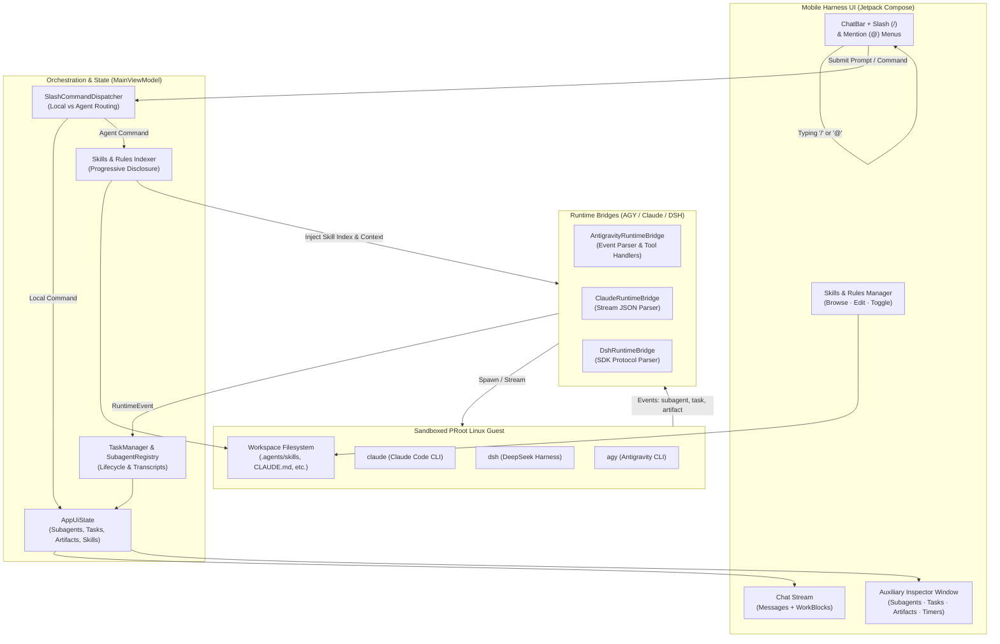

# Product Requirements Document (PRD)
## CLI Feature Parity: Slash Commands, Skills System, and Auxiliary Agent/Task Inspector for Mobile Harness

**Document Version:** 1.0.0  
**Status:** Ready for Implementation  
**Target Release:** Mobile Harness v2026.11  
**Target Platform:** Android (ARM64 PRoot Linux Runtime · Jetpack Compose)  
**Target Workspace:** `/workspace/clever-kalam`  
**Affected Subsystems:**  
- `app/src/main/java/com/jarves/mh/model/` (Data models: Slash commands, Skills, Subagents, Background Tasks, Artifacts)  
- `app/src/main/java/com/jarves/mh/runtime/` (Bridge layer: Event parsers, skill injectors, subagent orchestration, task management)  
- `app/src/main/java/com/jarves/mh/ui/` (UI layer: Slash command menu, @ mentions, Tasks & Subagents Auxiliary Pane, Skills Manager)  

---

## 1. Executive Summary & Problem Statement

### 1.1 Context
Mobile Harness (`mh`) provides a sandboxed Linux PRoot environment hosting three state-of-the-art AI coding agent engines on Android:
1. **Antigravity CLI (`agy`)**: Google's official coding agent engine with multi-account Google OAuth failover and access to Gemini 3.8/2.5 and Claude models.
2. **Claude Code (`claude`)**: Anthropic's terminal agent with deep tool execution and context tracking.
3. **DeepSeek Harness (`dsh`)**: DeepSeek's headless and SDK agent engine.

### 1.2 The Problem
While Mobile Harness successfully runs the backend binary engines of Claude Code, DeepSeek Harness, and Antigravity CLI, the mobile user interface currently provides only a basic chat stream and raw terminal view. It lacks the core capabilities of the desktop and CLI environments:
1. **No Slash (`/`) Commands**: Users cannot invoke standard workflows (`/plan`, `/goal`, `/compact`, `/cost`, `/doctor`, `/review`, `/model`, `/clear`, `/init`, `/grill-me`, `/learn`). Typing `/` does nothing in the input box.
2. **No Skills & Customization System**: The standard Antigravity/Claude skills framework (`SKILL.md` with YAML frontmatter, progressive disclosure, project rules `GEMINI.md`/`CLAUDE.md`/`AGENTS.md`) is completely absent. Users cannot teach the agent specialized procedures, install runbooks, or manage project guidelines.
3. **No Agent & Task Display Window (Auxiliary Pane)**: In the actual Antigravity 2.0 / CLI environment, complex tasks spawn subagents (`invoke_subagent`), background processes (`run_command`), scheduled timers (`schedule`), and structured artifacts. In Mobile Harness, these are either dropped, lumped into a generic text delta, or rendered as brief inline activity text, leaving users blind to concurrent subagents, background jobs, logs, and artifacts.
4. **No `@` Context Mentions**: Users cannot quickly attach files, folders, git diffs, or recent terminal outputs into prompts using standard `@file` autocompletion.
5. **No Token & Cost Telemetry**: Users have no visibility into active context consumption, cache read/write ratios, or session expenses.

### 1.3 The Solution
Implement the **CLI Parity & Auxiliary Inspector Suite** in Mobile Harness:
1. **Interactive Slash (`/`) Command Engine**: An intelligent auto-completing popup menu in the chat bar supporting client-side instant commands (`/clear`, `/cost`, `/doctor`, `/model`, `/help`) and agent-directed workflow commands (`/plan`, `/goal`, `/review`, `/init`, `/grill-me`, `/boost`, `/learn`).
2. **Progressive Skills & Rules System**: Full support for `SKILL.md` and rule files (`GEMINI.md`, `CLAUDE.md`, `AGENTS.md`), complete with a dedicated Skills Management UI, progressive disclosure indexing into agent context, and on-demand skill execution.
3. **Tasks & Subagents Auxiliary Inspector**: A dedicated mobile panel (accessible via top bar action, drawer, or workspace tab) containing:
   - **Subagents Tab**: Live tracking of subagents with role, state, live activity, and dedicated transcript reader.
   - **Background Tasks Tab**: Live tracking of background commands (`manage_task`), with real-time stdout/stderr tailing, stdin sending, and termination controls.
   - **Artifacts Tab**: Rendered Markdown viewer for structured outputs (PRDs, plans, architecture diagrams, test results).
   - **Timers Tab**: Active countdowns and schedules.
4. **`@` Mention System**: Inline fuzzy-matching file, git, and terminal reference picker in the prompt box.

---

## 2. High-Level Architecture & Interaction Diagram



---

## 3. Detailed Feature Specifications

### 3.1 Pillar 1: Slash (`/`) Command System

#### 3.1.1 Command Classification & Matrix
Commands are split into **Local Instant Commands** (handled entirely on device without an LLM turn) and **Agent Workflow Commands** (injected with prompt contracts or CLI flags).

| Command | Category | Execution Target | Supported Agents | Description |
| :--- | :--- | :--- | :--- | :--- |
| `/help` | General | Local | All | Displays categorized list of all slash commands, skills, and shortcuts. |
| `/clear` | General | Local | All | Resets the current chat turn context while preserving project files and history archives. |
| `/compact` | Context | Agent Turn | All | Summarizes earlier conversation turns to reclaim context window tokens. |
| `/cost` | Metrics | Local | All | Shows detailed token telemetry (input, output, cache read/write) and session expense. |
| `/model` | Config | Local Dialog | All | Opens interactive model and reasoning effort switcher. |
| `/doctor` | Diagnostics | Local + PRoot | All | Health check of PRoot, ARM64 binaries, Android SDK, Git, network, and OAuth tokens. |
| `/plan <task>` | Planning | Agent Turn | Antigravity, Claude | Forces agent to produce a structured, non-destructive step-by-step plan before code edits. |
| `/goal <task>` | Autonomous | Agent Turn | Antigravity | Autonomous mode with rigorous verification loops that does not stop until verified. |
| `/review` | Quality | Agent Turn | Claude, Antigravity | Automated code review of uncommitted changes or recent diffs. |
| `/init` | Setup | Agent Turn | All | Inspects repository structure and generates/updates `GEMINI.md` / `CLAUDE.md`. |
| `/grill-me` | Alignment | Agent Turn | Antigravity, Claude | Interactive interview mode to clarify architecture, trade-offs, and edge cases. |
| `/boost` | Reasoning | Agent Turn | Antigravity | High-effort turn activating multi-perspective reasoning and verification. |
| `/learn` | Guidelines | Agent Turn | Antigravity, Claude | Extracts session corrections into persistent rules saved in `AGENTS.md`. |
| `/browser <url>` | Web | Agent Turn | Antigravity | Web research and documentation exploration turn. |
| `/checkpoint` | VCS | Local Checkpoint | All | Creates an instantaneous named snapshot of the project workspace. |
| `/rollback` | VCS | Local Checkpoint | All | Reverts workspace files to the last checkpoint. |

#### 3.1.2 UI & UX Behavior
1. **Triggering**: Typing `/` at the beginning of the chat input or after whitespace immediately displays an elevated `SlashCommandMenu` directly above the text bar.
2. **Filtering**: Real-time fuzzy query filtering matches command name, aliases, and description (e.g. `/do` matches `/doctor`).
3. **Navigation**: Up/Down keyboard navigation or direct touch selection. Pressing `Tab` or clicking an item completes the command prefix into the text field.
4. **Parameter Hints**: Commands with arguments (e.g. `/plan <task>`) display an inline hint label in the text box.

---

### 3.2 Pillar 2: Skills & Customizations System

#### 3.2.1 Skill Standards & File Structure
Mobile Harness adopts the open Antigravity / Claude Code `SKILL.md` specification:
```markdown
---
name: android-release-builder
description: Builds, signs, zipaligns, and verifies production Android release APKs and AAB bundles.
---

# Android Release Builder Instructions
When asked to build a release APK:
1. Run `./gradlew bundleRelease assembleRelease`
2. Inspect outputs in `app/build/outputs/apk/release/`
3. Verify signature using `apksigner verify`
```

#### 3.2.2 Discovery Hierarchy & Priority
Skills are loaded with strict precedence (highest to lowest):
1. **Project Skills**: `<project_root>/.agents/skills/<name>/SKILL.md` or `.claude/skills/<name>/SKILL.md`
2. **Global User Skills**: `<app_data>/skills/<name>/SKILL.md` (shared across all projects)
3. **Bundled Default Skills**: Pre-installed skills in app assets (e.g. `android-developer`, `antigravity-guide`, `git-expert`, `code-reviewer`)

#### 3.2.3 Progressive Disclosure Mechanism
To conserve context window tokens:
1. **Indexing Phase**: When a session begins, only the YAML frontmatter (`name` and `description`) of all enabled skills is extracted into a compact Markdown table injected into the system prompt:
   ```markdown
   Available skills:
   - android-release-builder: Builds, signs, and verifies production Android APKs.
   - git-expert: Resolves complex merges, rebases, and clean commit history.
   ```
2. **Activation Phase**: When the agent or user invokes a skill (e.g. via `view_file` or typing `/skill:android-release-builder`), the bridge transparently injects the full `SKILL.md` body into the turn context.

#### 3.2.4 Skills Management UI
A new **Skills & Customizations Hub** screen (accessible via Settings or Workspace navigation) providing:
- **Skill Catalog**: Grouped by "Project", "Global", and "Bundled" with toggle switches to enable/disable.
- **Skill Detail / Preview**: Markdown reader showing description, instructions, examples, and file path.
- **Skill Creator / Editor**: In-app code editor with template generator to write and save new `SKILL.md` files directly on Android.
- **Project Rules Quick Editor**: Direct access to edit `GEMINI.md`, `CLAUDE.md`, or `AGENTS.md` without needing terminal commands.

---

### 3.3 Pillar 3: Agent & Task Display Window (Auxiliary Pane)

In modern AI developer platforms, complex workflows execute subagents, background jobs, and produce structured artifacts. Mobile Harness introduces the **Auxiliary Inspector Pane**.

#### 3.3.1 Panel Layout Options on Mobile
- **Bottom Sheet Mode**: Expandable floating pill on the chat screen ("2 subagents active · 1 task running") that drags up into a split or full-screen modal.
- **Dedicated Tab Mode**: A new tab in `WorkspaceTab`: `WorkspaceTab.TASKS` (icon: `Icons.Default.Layers` / `Icons.Default.Psychology`).

#### 3.3.2 Subagents Tab
Tracks every agent spawned via `invoke_subagent` (e.g. `research`, `self`, `planner`, `tester`):
- **Card Metrics**:
  - `role`: Human-readable title (e.g. "Codebase Researcher", "Lint Fixer").
  - `type`: Base agent type (`research`, `self`, `custom`).
  - `conversationId`: Unique ID for message routing.
  - `status`: Badge with state indicator:
    - 🟢 `running`: Animated pulsing indicator showing live tool name.
    - 🟡 `waiting_for_input`: Waiting for user response to a question.
    - 🔵 `waiting_for_dependents`: Waiting on another subagent.
    - ⚪ `idle` / `done`: Completed turn.
    - 🔴 `errored`: Error reason.
- **Transcript & Task Log Viewer**: Clicking any subagent card opens the **Subagent Transcript Inspector Modal**, featuring:
  - Formatted step view with collapsible thinking chains, invoked tool parameters, output payloads, and errors.
  - Raw JSONL stream view directly from `transcript.jsonl`.
  - One-tap "Copy Transcript" and interactive "Send Message" (`send_message(Recipient=conversationId)`) controls.
- **Interactive Controls**: Send message directly to child agent (`send_message`), or terminate subagent (`manage_subagents(kill)`).

#### 3.3.3 Background Tasks Tab
Tracks asynchronous CLI commands executed in background (e.g. `task-123` via `run_command` or long-running servers):
- **Card Metrics**:
  - `taskId`: Human-friendly ID (e.g. `task-335`).
  - `commandLine`: The exact shell command (e.g. `./gradlew assembleDebug`).
  - `workingDir`: Working directory.
  - `duration`: Live timer showing elapsed execution time.
  - `status`: Running, Success (exit 0), Failed (exit non-zero), Terminated.
- **Live Terminal Log Viewer Modal**: Clicking any task card opens the full **Task Terminal Log Inspector**, displaying:
  - Real-time scrolling stdout/stderr console stream from `liveOutputTail` or task log file (`logFilePath`).
  - Auto-scroll to bottom with scroll-lock detection for reading previous output.
  - One-tap "Copy Logs" button and stdin input bar (`manage_task(send_input)`).
- **Interactive Actions**:
  - **Send Input**: Send interactive stdin text into the background process.
  - **Kill**: Send SIGTERM/SIGKILL via `manage_task(kill)`.
  - **Status Refresh**: Query task health.

#### 3.3.4 Artifacts & Documents Tab
Captures structured documents created by the agent:
- Detects files matching:
  - `<appDataDir>/brain/<conversation-id>/*.md`
  - Workspace markdown documents created as outputs (PRDs, plans, summaries, reports).
- Dedicated high-performance Markdown renderer:
  - Supports Mermaid diagram rendering (`flowchart`, `sequenceDiagram`, `stateDiagram`).
  - Code syntax highlighting with one-tap "Copy to clipboard".
  - One-tap "Share as Markdown file" to external Android apps.

#### 3.3.5 Scheduled Timers & Cron Tab
- Displays active timers scheduled by the agent or user (`schedule(DurationSeconds=...)`):
  - Remaining time countdown.
  - Trigger condition (`never`, `any`, sender ID).
  - One-tap "Cancel Timer" button.

---

### 3.4 Pillar 4: Context Mentions (`@` Mentions) & Token Telemetry

#### 3.4.1 `@` Context Mention Palette
Typing `@` in the chat input opens the context mention popup with 5 categories:
1. **`@file <path>`**: Fuzzy search over `workspaceFiles`. Selecting a file inserts `@{relative/path}` and automatically attaches the file metadata.
2. **`@folder <path>`**: Inserts directory structure overview.
3. **`@git:diff` / `@git:log`**: Injects uncommitted changes or last 5 commits into the message context.
4. **`@terminal:last`**: Injects the command and output of the most recent terminal run.
5. **`@skill:<name>`**: Mentions and immediately forces activation of a specific skill.

#### 3.4.2 Live Token Telemetry Bar
A compact, elegant status bar placed just above the chat bar:
- **Tokens In/Out**: `4,210 in · 1,450 out (820 cached)`.
- **Context Bar**: Colored visual bar showing percentage of model context used (e.g. `12% of 200K`).
- **Turn Latency & Speed**: `45 tok/s · 2.8s latency`.

---

## 4. Data Models & API Contracts

### 4.1 Slash Command Model
```kotlin
enum class SlashCommandCategory { GENERAL, AGENT_WORKFLOW, CONFIG, DIAGNOSTICS, VCS }

data class SlashCommand(
    val name: String,                    // e.g. "plan"
    val description: String,             // e.g. "Create step-by-step implementation plan"
    val syntax: String = "/$name",       // e.g. "/plan <task>"
    val category: SlashCommandCategory,
    val isLocalOnly: Boolean = false,    // true if handled on-device without LLM turn
    val supportedAgents: Set<AgentKind> = AgentKind.entries.toSet(),
    val icon: androidx.compose.ui.graphics.vector.ImageVector,
)
```

### 4.2 Skills Data Models
```kotlin
enum class SkillSource { PROJECT, GLOBAL, BUNDLED }

data class SkillInfo(
    val id: String,                      // unique identifier
    val name: String,                    // YAML frontmatter name
    val description: String,             // YAML frontmatter description
    val filePath: String,                // path to SKILL.md
    val source: SkillSource,
    val isEnabled: Boolean = true,
    val markdownContent: String? = null,
)

data class ProjectRule(
    val fileName: String,                // "GEMINI.md", "CLAUDE.md", "AGENTS.md"
    val filePath: String,
    val exists: Boolean,
    val content: String = "",
)
```

### 4.3 Subagent & Background Task Models
```kotlin
enum class SubagentState { RUNNING, IDLE, WAITING_FOR_INPUT, WAITING_FOR_DEPENDENTS, DONE, ERRORED }

data class SubagentInfo(
    val conversationId: String,
    val role: String,
    val typeName: String,
    val state: SubagentState,
    val currentActivity: String = "",
    val transcriptPath: String? = null,
    val startedAtMillis: Long = System.currentTimeMillis(),
    val finishedAtMillis: Long? = null,
    val error: String? = null,
)

enum class BackgroundTaskStatus { RUNNING, COMPLETED, FAILED, TERMINATED }

data class BackgroundTaskInfo(
    val taskId: String,
    val commandLine: String,
    val cwd: String,
    val status: BackgroundTaskStatus,
    val exitCode: Int? = null,
    val startedAtMillis: Long = System.currentTimeMillis(),
    val logFilePath: String? = null,
    val liveOutputTail: String = "",
)

data class ArtifactInfo(
    val id: String = java.util.UUID.randomUUID().toString(),
    val title: String,
    val filePath: String,
    val summary: String,
    val isUserFacing: Boolean = true,
    val createdAtMillis: Long = System.currentTimeMillis(),
)

data class ScheduledTimerInfo(
    val taskId: String,
    val prompt: String,
    val totalSeconds: Int,
    val remainingSeconds: Int,
    val condition: String = "never",
    val isCron: Boolean = false,
    val cronExpression: String? = null,
)
```

### 4.4 Extended Runtime Events
```kotlin
sealed interface ExtendedRuntimeEvent : RuntimeEvent {
    // Subagent events
    data class SubagentCreated(override val sessionId: String, val subagent: SubagentInfo) : RuntimeEvent
    data class SubagentStateChanged(override val sessionId: String, val conversationId: String, val state: SubagentState, val detail: String) : RuntimeEvent
    
    // Background Task events
    data class TaskSpawned(override val sessionId: String, val task: BackgroundTaskInfo) : RuntimeEvent
    data class TaskOutputChunk(override val sessionId: String, val taskId: String, val chunk: String) : RuntimeEvent
    data class TaskFinished(override val sessionId: String, val taskId: String, val exitCode: Int) : RuntimeEvent
    
    // Artifact & Timer events
    data class ArtifactCreated(override val sessionId: String, val artifact: ArtifactInfo) : RuntimeEvent
    data class TimerScheduled(override val sessionId: String, val timer: ScheduledTimerInfo) : RuntimeEvent
    data class TimerCancelled(override val sessionId: String, val taskId: String) : RuntimeEvent
    
    // Telemetry events
    data class TokenUsageReport(
        override val sessionId: String,
        val promptTokens: Int,
        val completionTokens: Int,
        val cachedTokens: Int,
        val contextLimit: Int,
    ) : RuntimeEvent
}
```

---

## 5. Implementation Roadmap & Milestones

### Milestone 1: Slash (`/`) Commands Engine & Client Dispatcher
- [ ] Implement `SlashCommandRegistry` with full command definitions.
- [ ] Build `SlashCommandMenu` composable with animated entrance, query filtering, and keyboard navigation.
- [ ] Implement `SlashCommandDispatcher` in `MainViewModel`:
  - Handle `/clear`, `/help`, `/cost`, `/model`, `/doctor`, `/checkpoint`, `/rollback` locally.
  - Wrap `/plan`, `/goal`, `/review`, `/init`, `/grill-me`, `/learn` into specialized prompt payloads for the active bridge.
- [ ] Unit test command parsing and local actions.

### Milestone 2: Skills & Customizations Framework
- [ ] Implement `SkillScanner` in `app/src/main/java/com/jarves/mh/runtime/` to discover `.agents/skills`, `.claude/skills`, and global skills.
- [ ] Add YAML frontmatter parser for `SKILL.md`.
- [ ] Implement progressive disclosure prompt injector: append available skills table to system context.
- [ ] Create `SkillsManagerScreen` / BottomSheet: catalog view, skill preview, in-app `SKILL.md` editor, and project rules (`GEMINI.md`/`CLAUDE.md`) editor.
- [ ] Unit test skill indexing, parsing, and progressive disclosure injection.

### Milestone 3: Tasks, Subagents & Artifacts Auxiliary Inspector
- [ ] Extend `AntigravityEventParser`, `ClaudeRuntimeBridge`, and `DshRuntimeBridge` to capture:
  - `invoke_subagent`, `manage_subagents` -> `SubagentInfo`
  - `run_command` (async), `manage_task` -> `BackgroundTaskInfo`
  - `write_to_file` in artifact directory -> `ArtifactInfo`
  - `schedule` -> `ScheduledTimerInfo`
- [ ] Add `SubagentRegistry` and `TaskManager` in `MainViewModel`.
- [ ] Build `AuxiliaryInspectorSheet` with tabs:
  - **Subagents**: List cards with live state badges, one-tap stop action, and tap-to-view modal for structured transcript steps and raw JSONL logs.
  - **Background Tasks**: Monospace command cards, live status, one-tap stop action, and tap-to-view modal for live terminal output streaming (`liveOutputTail` / `logFilePath`) and stdin input.
  - **Artifacts**: Markdown & Mermaid viewer with export/share.
  - **Timers**: Live countdown with cancel button.
- [ ] Add floating status chip in `ChatTab` showing count of active subagents and background tasks.

### Milestone 4: `@` Context Mentions & Telemetry Bar
- [ ] Build `@` mention popup menu in `ChatTab` with fuzzy matching across files, folders, git diffs, and skills.
- [ ] Add compact Token Usage & Context window capacity bar above the prompt bar.
- [ ] Connect token telemetry parser from upstream gateway / Cloud Code PA responses.
- [ ] End-to-end integration tests & APK build verification.

---

## 6. Success Metrics & Validation Criteria
1. **User Experience**: Fast, lag-free slash command popup with zero stutter during typing.
2. **Context Efficiency**: Progressive disclosure keeps baseline system prompt token overhead below 500 tokens while providing access to unlimited skills.
3. **Observability**: Users can track concurrent subagents and background build tasks in real-time without terminal switching.
4. **Reliability**: 100% backward compatible with existing chats and projects; zero crash regressions across ARM64 devices.
